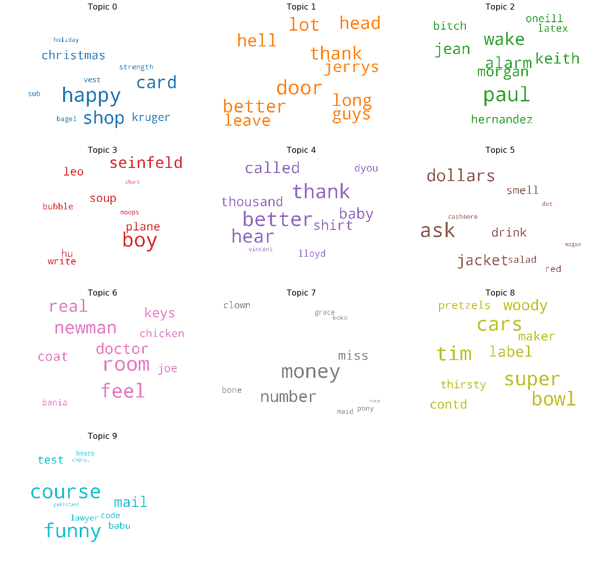

# A Capstone About "Nothing"
Capstone Project for Galvanize Data Science Immersive 

by Matt Devor

## Table of Contents
- [Introduction](#introduction)
- [Strategy and Process](#strategy-and-process)
- [Overview of the Data](#overview-of-the-data)
- [Exploratory Data Analysis](#exploratory-data-analysis)
  * [EDA Takeaways](#eda-takeaways)
- [Unsupervised Learning: LDA with Sklearn](#unsupervised-learning-lda-with-sklearn)
- [Unsupervised Learning: LDA with Gensim/spaCy](#unsupervised-learning-lda-with-gensimspacy)
- [Sentiment Analysis](#sentiment-analysis)
  * [Episodes with the Highest Percentage of Negative Lines](#episodes-with-the-highest-percentage-of-negative-lines)
  * [Episodes with Highest Percentage of Positive lines](#episodes-with-highest-percentage-of-positive-lines)
  * [Tying Previous Analysis Together](#tying-previous-analysis-together)
- [Text Generation](#text-generation)
- [Reflection and Future Work](#reflection-and-future-work)
  * [Reflection](#reflection)
  * [Future Work](#future-work)


# Introduction
Seinfeld is an American television sitcom that ran for nine seasons on NBC, from 1989 to 1998. It was created by Larry David and Jerry Seinfeld, with the latter starring as a fictionalized version of himself. Set predominantly in an apartment building in Manhattan's Upper West Side in New York City, the show features a handful of Jerry's friends and acquaintances, including best friend George Costanza, friend and former girlfriend Elaine Benes, and neighbor across the hall Cosmo Kramer. It is often described as being "a show about nothing", as many of its episodes are about the minutiae of daily life. [source: wiki](https://en.wikipedia.org/wiki/Seinfeld)


I have been a huge fan of this show for around two decades, and still find myself going back and enjoying old episodes. I think the writing is absolutely brilliant, still holds up (even if some of the references are dated), and really appreciate the way that Larry David in particular can transform seemingly mundane daily occurrences into entertaining dialogue. 

I discovered a database containing scripts for every Seinfeld episode (located [here](https://www.kaggle.com/thec03u5/seinfeld-chronicles)), with dialogue separated by character. Since I hadn't previously had an opportunity to do a deep-dive with NLP, and because NLP has so many practical applications, I thought this would be a fun corpus to take on and try to extract meaning from. 

Initially, I deiced to use LDA and sentiment analysis to better inform my EDA and understanding of the corpus. Unsupervised learning in the form of LDA can quickly turn into an almost endless feedback loop (which I soon realized), but I was able to at least extract some interesting themes, dialogue snippets, and catch phrases from that analysis. I also thought it would be a very interesting problem to try and see if I can train a model to emulate the speech patterns of the four main characters mentioned above, and even create a model that would “predict”/generate the script for a new episode of Seinfeld.


[Back to Top](#Table-of-Contents)

# Strategy and Process
- Overview of Data
- Exploratory Data Analysis
- Unsupervised Learning: LDA - Sklearn
- Unsupervised Learning: LDA - Gensim/spaCy
- Sentiment Analysis with VADER
- Text Generation
- Reflection and Future Work

# Overview of the Data
- This dataset consists of two databases:
  - The first is 174 rows: a row for each episode of Seinfeld created, and includes features such as season, episode #, Title, AirDate, Writer(s), and Director.  
  - The second is ~54,600 rows: a row for each line of dialogue spoken by each character within each episode, and includes features such as Character (who is speaking), Dialogue (what they say), EpisodeNo, SeasonEpisodeID, and Season. 
- There are 9 seasons of Seinfeld, with the pilot airing on June 7th, 1989, and the final episode airing May 14th, 1998.
- There are only 10 NaNs in the dialogue dataset, and as there is no dialogue info for those rows, I decided it was ok to drop them.
- There are an average of ~17,000 alphanumeric characters in each Seinfeld episode script, and a total of 2,920,645 characters in the entire series.
- Depending on how the text is cleaned tokenized, and stemmed/lemmatized, there are approximately 8,500 unique words in the corpus.


[Back to Top](#Table-of-Contents)

# Exploratory Data Analysis
To begin exploring  this dataset, I decided to look at who speaks the most over the entire series. As expected, Jerry has the most lines of all the main characters, followed by George, Elaine, and Kramer. I thought it was interesting how large of a drop off there was between these four main characters, and the rest of the characters in the series. Also, while not shown in the graph below, there are ~1,600 unique characters in the entire series.


I also thought it would be interesting to see how the dialogue was divided among the characters as the seasons progressed, and the chart below shows the % of lines spoken by each main character by season. It's definitely interesting how big of a role Jerry played in the first two seasons, and how that usage dropped quite dramatically from the first through the third season. As I explain below, I believe this might be in part due to the fact that Jerry didn't write as many episodes after the first two seasons. We can also see Kramer's role steadily increasing as the show progresses.


Another interesting metric that I looked at was who the writers were for each episode. In the plot below, I aggregated % of episodes written across seasons, and we can see the huge role that Larry David and Jerry had in writing the first two seasons. As that writing role diminishes, we can see other writers coming into the fold, but no one writer or writing team dominates much after season 5 or so. Larry Charles is another name that gets associated with Seinfeld quite often, and here you can see his increased role in writing seasons two and four.


The chart below is meant to illustrate the **massive** amount of different writers and writing teams that contributed to Seinfeld. While we can see that Larry David and Jerry wrote the bulk of the episodes, this definitely shows how much of a collaborative writing effort the series as a whole really was. I also found it fascinating that most of the writing teams only wrote 1 episode, so the fact that the show has such coherence between episodes/characters is impressive. 


The final metrics I decided to look at for my EDA were average number of lines per episode and average number of characters (letters/numbers/punctuation, not characters in the show) per episode. In the plot below, we can see that average lines per episode stays constant in seasons 1 and 2, and then increases by ~50 lines per episode in season 3. In general, this metric keeps rising as the seasons go on, and while the episode lengths in terms of total minutes stayed the same, this indicates more back-and-forth dialogue between characters. Said differently, this metric shows how many times the person speaking changes, on average, per episode. 

The other metric this graph shows is average number of alphanumeric characters, or total script length, per episode. It's interesting to see the decreasing trend of total script length in the first three seasons, as it seems like in those early seasons each character would speak longer per line of dialogue. After season 3, it seems like the show found a nice balance of lines per episode and script length, as those two appear to be linearly correlated for the rest of the seasons.


## EDA Takeaways
- Jerry definitely speaks the most, as expected, but his lines of dialogue as a % of the total decreased as the seasons went on.
- George's role also decreased a bit after season 4, which corresponds to Larry David writing fewer episodes, and this makes sense because the character of George is based on Larry David himself.
- Larry David and Jerry Seinfeld wrote almost the entire first season themselves, and the bulk of the second season as well.
- After season 4, the writing was done by a much larger pool of people, and no one writer really dominated.
- There are are over 50 unique writing teams who wrote Seinfeld episodes, but the bulk of them only wrote one episode.
- Lines of dialogue per episode increased as the seasons went on, indicating more back-and-forth dialogue between characters. 


[Back to Top](#Table-of-Contents)

# Unsupervised Learning: LDA with Sklearn
Latent Dirichlet Allocation is an unsupervised modeling technique, used to derive (k=num_topics) latent topics from corpuses of text (collections of documents). There are many examples of real-world use cases for this technique, such as search engines, text to speech, classifying social media users, and many more.

The LDA algorithm takes an input X matrix and creates phi and theta matrices, which relate to the input matrix as follows:

| Matrix | Dimensions| Relates | Contains |
|---|---|---|---|
|X (input) | n x m | documents (n rows) to features/words (m columns) | Term frequency matrix of tokenized words, i.e. the number of times each word appears in each document. |
|φ (phi) | k x m | topics (k rows) to features/words (m columns) | Composition of topics, in terms of which words comprise each topic. All rows sum to 1. |
|θ (theta) | n x k | documents (n rows) to topics (k columns) | Topic distribution within each document. Each document can contain multiple topics. All rows sum to 1. |

As with any unsupervised modeling technique, as there is nothing we are really "predicting" with this approach, it is quite difficult to accurately evaluate an LDA model quantitatively. Much of the value gained from topic modeling, and LDA specifically, is the ability to come up with a human-comprehensible understanding of the topics the model spits out. While optimally this topic labelling can be done by looking at the most important keywords for each topic, it can still be quite difficult to separate topics into concrete "buckets".

I began topic modeling of this corpus by combining the lines of dialogue into one large block of text for each episode, therefore creating a "script" for each episode and each season. I then took the following steps to clean the data and feed it through sklearn's LDA model:
- Corpus = dialogue for each episode
- Remove all apostrophes from each word in corpus since CountVectorizer will not include contractions otherwise.
- Convert corpus to lower case.
- Initially, use NLTK's default stop words.
- Use `CountVectorizer` to convert coprus into term frequency matrix for each document.
- Choose k = num_topics
- Create lda model using `LatentDirichletAllocation`
- Look **manually** at most important key words for each topic and determine of those **make sense** and differentiate the topics well. 
- If words are repeated often between topics, we're not seeing much differentiation.
- Adjust stop words accordingly and repeat all steps above until you have an LDA model that is somewhat informative.

After doing all of the steps above, I ended up with 10 topics, and the word cloud below shows the 10 most important keywords for each of those topics. These 10 topics were chosen because with only around 5 or 6 topics, I really wasn't seeing any differentiation between the keywords in each topic, and with more than 10 topics, due to the fact that the corpus only contains 174 episodes, I was seeing some topics that almost only encompass one episode/document.

Also, while this analysis didn't really produce any concrete "topics" that are generalizable to multiple episodes, it did pull out some key words and characters that are very episode-specific. For example, "Keith Hernandez" shows up in topic two, as does "latex", and in the episode "The Boyfriend", Jerry meets his idol, Keith Hernandez (former New York Mets baseball player), and George tells the unemployment office that he's close to a job with Vandelay Industries, a company he made up that makes latex products.



[Back to Top](#Table-of-Contents)

# Unsupervised Learning: LDA with Gensim/spaCy
In order to continue learning as much as possible about LDA, and the python libraries available for NLP, I decided to use Gensim/Spacy to do topic modeling on the corpus of episodes as well. Gensim makes it very easy to create bigram and trigram models, and spaCy's lemmitization feature allows one to take only the parts of speech they are interested in. In this case, I decided to only use nouns, adjectives, verbs, and adverbs, in order to reduce the amount of words that would be less useful to differentiate topics. 

For this model, I also went through many iterations of adding to the stop words list, and these are the additional stop words I used, in order to see more differentiation between the topics:

```
'people', 'happen', 'bad', 'ask', 'anything', 'love' 'nice', 'show','doctor', 'eat', 'hear', 'watch','big' 'meet', 'dog', 'life', 'great', 'kind', 'start', 'funny', 'car', 'keep', 'head', 'find', 'feel' 'everything', 'pick', 'remember', 'boy', 'listen', 'hand', 'sit', 'move', 'sure', 'name', 'still', 'stop', 'wanna', 'new', 'day', 'phone', 'laugh', 'may', 'from', 'subject', 're', 'edu', 'use', 'be', 'get', 'go', 's', 'know', 'see', 'come', 'want', 'look', 'jerry', 'george', 'kramer', 'well', 'tell', 'say', 'think', 'make', 'would', 'could', 'right', 'take', 'good', 'really', 'elaine', 'ill', 'back', 'guy', 'talk', 'something', 'mean', 'thing', 'call', 'give', 'let', 'man', 'little', 'way', 'friend', 'put', 'like', 'time', 'never', 'thank', 'work', 'need', 'woman', 'leave', 'maybe', 'try', 'nothing', 'much'
```
As we can see below, this model didn't really perform any better in terms of grouping Seinfeld episodes into "topics", but once again we have quite a few episode specific words and characters, including "yada_yada", "festivus", "fusilli", and "sponge".


In order to have a more quantitative approach to evaluating an LDA model, I decided to focus on Gensim's "Coherence" score, which is basically measure of how well a topic model splits documents into easily definable topics. The plot below shows hoe the coherence score changes as the number of topics increases.


From the chart above, it appeared that 14 topics resulted in a good balance between number of topics and coherence score, as coherence score didn't increase much after that. As such, I then re-ran the gensim LDA model with 14 topics, and the gif below is a two-dimensional representation of those topics, along with the 30 most important words for each topic. As we can see, the bulk of the language used within Seinfeld episodes overlaps considerably, with the episodes that are quite different from the norm being shown as smaller topics that are further away from the first 5.


[Back to Top](#Table-of-Contents)

# Sentiment Analysis


In order to understand this corpus better, and to be able to learn yet another NLP tool, I decided to use NLTK's VADER library to do sentiment analysis on each line of dialogue within the corpus. The aim of sentiment analysis is to gauge the attitude, sentiments, evaluations, attitudes and emotions of a speaker/writer based on the computational treatment of subjectivity in a text. I also think that this sentiment analysis could potentially be useful when evaluating the results of my generative model, and I could even incorporate some sort of feedback loop to increase the positivity or negativity of a character's dialogue.

VADER (Valence Aware Dictionary and sEntiment Reasoner) is a lexicon and rule-based sentiment analysis tool that is specifically attuned to sentiments expressed in social media. VADER uses a combination of A sentiment lexicon is a list of lexical features (e.g., words) which are generally labelled according to their semantic orientation as either positive or negative. Also, VADER doesn't require any training data, which means it can be used right out of the box.

Example of a line of dialogue with positive sentiment:
```
Jerry: You know George they are doing wonderful things at mental institutions these days. I'd be happy to set-up a meet and greet.

{'neg': 0.0, 'neu': 0.65, 'pos': 0.35, 'compound': 0.8658}
```

Example of a line of dialogue with negative sentiment:
```
Kramer: If I don't have a good shower I am not myself. I feel weak and ineffectual. I'm not Kramer.

{'neg': 0.242, 'neu': 0.631, 'pos': 0.127, 'compound': -0.296}
```

The sentiment for the entire series is as follows:
- Positive lines: 31%
- Negative lines: 16%
- Neutral lines: 53%

The plot below shows how sentiment changes over the seasons. We can see that season two by far has largest % of negative lines, and season 6 is the most positive. I thought it was interesting that the number of negative lines seemed to trend with the number of episodes Larry David wrote.


The chart below shows how each main character's sentiment changes over the seasons. As we can see, George gets very negative in season two, and then he an all the other characters have less negative lines as time goes on. We can also see that Kramer gets more and more positive as the seasons go on. 


##  Episodes with the Highest Percentage of Negative Lines

|   Season  | Title             | AirDate   | Writers                     | Director      |   Percent Positive |   Percent Negative |
|----:|:------------------|:----------|:----------------------------|:--------------|-------------------:|-------------------:|
|   2 | The Ex-Girlfriend | 16-Jan-91 | Larry David, Jerry Seinfeld | Tom Cherones  |           0.32 |           0.25  |
|   2 | The Pony Remark   | 30-Jan-91 | Larry David, Jerry Seinfeld | Tom Cherones  |           0.28     |           0.24     |
|   8 | The Little Kicks  | 10-Oct-96 | Spike Feresten              | Andy Ackerman |           0.29 |           0.23 |
|   2 | The Baby Shower   | 16-May-91 | Larry Charles               | Tom Cherones  |           0.24 |           0.23  |
|   2 | The Jacket        | 6-Feb-91  | Larry David, Jerry Seinfeld | Tom Cherones  |           0.29 |           0.23 |

**Synopsis for "The Ex-Girlfriend":**

George wants to break up with his girlfriend Marlene, whose tendency to drag out conversations and phone messages irritates him to no end. After an emotional split, he realizes he has left some books in her apartment. Jerry tries to convince George that he does not need the books, as he has already read them, but George nevertheless persuades Jerry to get them for him. To retrieve the books, Jerry decides to go on a date with Marlene, during which she tells him that she and Jerry can still be friends, despite her recent break-up. Jerry and Marlene start dating, but after a while, Jerry finds her just as annoying as George did. He wants to break up with her, but finds she has a "psycho-sexual" hold on him.

## Episodes with Highest Percentage of Positive lines

|  Season  | Title               | AirDate   | Writers                      | Director           |   Percent Positive |   Percent Negative |
|---:|:--------------------|:----------|:-----------------------------|:-------------------|-------------------:|-------------------:|
| 4 | The Trip (1)        | 12-Aug-92 | Larry Charles                | Tom Cherones       |           0.42 |          0.12  |
|  1 | Good News, Bad News | 5-Jul-89  | Larry David, Jerry Seinfeld  | Art Wolff          |           0.42 |          0.15  |
|  5 | The Fire            | 5-May-94  | Larry Charles                | Tom Cherones       |           0.41 |          0.15  |
| 4 | The Visa            | 27-Jan-93 | Peter Mehlman                | Tom Cherones       |           0.41 |          0.17  |
| 6 | The Secretary       | 8-Dec-94  | Carol Leifer, Marjorie Gross | David Owen Trainor |           0.41 |          0.10 |

**Synopsis for "The Trip":** 

Jerry is offered two free tickets from New York City to Hollywood to appear on The Tonight Show with Jay Leno. He offers one to George and they decide that while they are in Los Angeles they will track down Kramer, who headed to Los Angeles in the previous episode, "The Keys", to become an actor. A dead woman turns up in another part of LA and Kramer's script he had given to her is found on her body. George thinks he has insightful conversations with the talk show guests (Corbin Bernsen and George Wendt) but they both call him "some nut" when they appear publicly. 

[Back to Top](#Table-of-Contents)

## Tying Previous Analysis Together
In order to cohesively combine all of the above analysis, I thought it'd be fun to take a look at one of my favorite episodes, and see how it looks with respect to topic modeling and sentiment analysis. 

Epside name: **"The Summer of George"**
- **Season:** 8
- **Writers:** Alec Berg, Jeff Schaffer
- **Synopsis:** George discovers he has a severance package from the New York Yankees that should last him about 3 months, so he decides that he's going to take full advantage of 3 months off and become very active. However, instead of living a very active lifestyle as he'd planned, George becomes extremely lazy. He never changes out of his pajamas, and feels too weak to even come to Jerry's apartment, asking Jerry, Elaine and Kramer to instead visit him or talking to Jerry on the phone to know what's going on over at his apartment.
- **Dominant Topic using sklearn:** 1 (general episodes)
  - Keywords: "door, head, better, jerrys, long, hell, leave, thank, lot, guys"
- **Dominant Topic using Gensim/spaCy:** 5 (general episodes)
  - Keywords: "door, break, door, break, walk, guess, apartment, turn, place, run, hell, room"
- **Dominant Topic using optimal topic model:** 1 (general episodes)
  - Keywords: "run, hell, turn, problem, wait, point, hold, help, even, door"
- **Positive Lines:** 27%
- **Negative Lines:** 17%
- **George Positive lines:** 27%
- **George Negative lines:** 12%

Similar episodes using cosine pairwise distance: 

| Title | Season | Writers | Synopsis | 
| --- | --- | --- | --- | 
| The Barber    | 5 | Andy Robin | At a job interview, George's interviewer, Mr. Tuttle, is cut off mid-sentence by an important telephone call, and sends George away without saying whether he has been hired or not. Mr. Tuttle told George that one of the things that make George such an attractive hire is that he can "understand everything immediately", so George is afraid to call and ask for clarification. |
|  The Suicide | 3 | Tom Leopold  | After his neighbor Martin tries to commit suicide and ends up in a coma, Jerry is hit on by his girlfriend, Gina. Elaine and George visit a psychic at her apartment, who warns George to cancel his vacation to the Cayman Islands. When Elaine rebukes her for smoking while pregnant, the psychic kicks them out before telling George why he should cancel.|
| The Burning | 9 | Jennifer Crittenden  | At the coffee shop, George laments to Jerry about losing respect at a project meeting led by Mr. Kruger after following a good suggestion with a bad joke. Jerry suggests that George use the Vegas showmanship trick of leaving the room after a comedic high note. |
| The Fusilli Jerry | 6 | Marjorie Gross | Kramer goes to the Department of Motor Vehicles for his new license plate. To his surprise, the plate reads "ASSMAN". He suspects that the plate was meant for a proctologist, and uses this theory to his advantage, by parking in a "Doctors Only" spot when he goes to pick up Estelle. The plate also scores him cat calls from passing drivers, and a date with a big-bottomed woman named Sally.|
| The Good Samaritan| 3 | Peter Mehlman | Jerry witnesses a hit-and-run driver hitting another car. He is on the car phone with Elaine, who tells him he has to go after the driver. He does, but when the driver steps out he sees that she is a beautiful woman named Angela (played by Melinda McGraw) and decides to date her. Jerry lies to Elaine, saying he pursued the driver into Queens and intimidated him with karate moves. |

[Back to Top](#Table-of-Contents)

# Text Generation
While I haven't done much with text generation yet, I have been looking into several options for my model, and will most likely use a LSTM RNN as my final model. There are quite a few different methodologies that can be applied when creating these types of models, and the three main ways to generate text are character-based, word-based, and word-vector based. In a character-based model, the prediction happens one character at a time, with the neural network inputs being the sequence of characters before the character being predicted. This allows for the number of potential predictions (y-values) to be quite small, in that it's only: `letters in the alphabet + digits 0-9 + punctuation`.

For my first model, I am using the following parameters:
- Window size: sequence of 60 characters, predict the 61st
- Number of potential alphanumeric characters: 50 (letters in the alphabet + digits 0-9 + punctuation)
- Number of alphanumeric characters used to create X and y values: 100,000
- End up with an X matrix that is (99,940 x 60 x 50) and a y matrix that is (99,940 x 50)
- Number of LSTM layers: 1
- Number of neurons in that layer: 228

I realized through trial and error that much of the difficulty in creating an LSTM model is in vectorizing the text into X and y values.
Below shows a few examples of how I am segmenting the text into sequences and chracters to predict for the initial character-based LSTM model.


This results in the following X (sequence) and y (target) matrices:


I thought it would be interesting to see how this basic model would predict dialogue using a prompt from "The Summer of George". 

Sample Dialogue from "The Summer of George":
```
george: all right, that's enough. i gotta go home and take a nap. 

jerry: it's 10:30 in the morning? 

george: i tell you; i'm wiped. 

jerry: so, has the summer of george already started or are you still de-composing? 

george: de-compressing. 
```

Predicting dialogue using first line from above, with a low temperature value (less randomness):
```
Seed Text:
george: all right, that's enough. i gotta go home and take a . 

Predicted Dialogue:
george: all right, that's enough. i gotta go home and take a shower? 

jerry: i dont know. i dont know. i dont know. i think i do that. 

jerry: i dont know. i dont know. i have to get the shoe off on the stock with women around the signal! 

jerry: what do you know what i would point to that i dont know.

```

Predicting dialogue using first line from above, with a high temperature value (more randomness):
```
Seed Text:
george: all right, that's enough. i gotta go home and take a . 

Predicted Dialogue:
george: all right, that's enough. i gotta go home and take at this couch with a problem put the elevator 
in from got over there right now. 

jerry: you can i tester. 

jerry: what was the car? 

george: hes a persot. i hate the dryer sellised in the bitco moving out with this problem to get the lobby 
tickets to the eggees to come to play should see is we have a lot of here. 

jerry: so what i do? i love her
```

With low temperature values, I noticed that almost all the characters were saying **"I don't know"** constantly, so I thought my model might be  predicting things completely incorrectly.
But then I found [this](https://www.youtube.com/watch?v=xr3Tjx-e71c), and my model totally makes sense now! ;)

[Back to Top](#Table-of-Contents)

# Reflection and Future Work
## Reflection
- Overall, this was a really fun corpus to work with, and I learned a lot about Seinfeld, in the process of learning much more about NLP.
- I realized that topic modeling can often be very difficult to draw conclusions from , but will still give you insights related to your documents, even if you can't discern concrete "topics".
- Sentiment analysis using VADER is really quick and easy to use right out of the box.
- Even a character-based LSTM model is pretty amazing, in that it's able to produce somewhat coherent sentences and dialogue.

## Future Work
- I would like to continue with text generation/prediction, creating more of a back-and-forth dialogue model using several potential approaches:
  - Character-based 
  - Character-based: seq2seq
  - Word-based
  - Word-vector based
  - Chatbot based approach (questions and answers)
- A few limitations with these models will be training time, as with trying to predict a word using the N words before that word, the  prediction space is suddenly your entire vocabulary! 
- This makes for a potentially HUGE (6,500+ depending on vocab) # of word prediction options, which will in turn require much more processing power.
- However, I believe that these types of model "might" be more accurate overall, in that they can internally take the context of each word into account, within the LSTM neural network.

[Back to Top](#Table-of-Contents)
